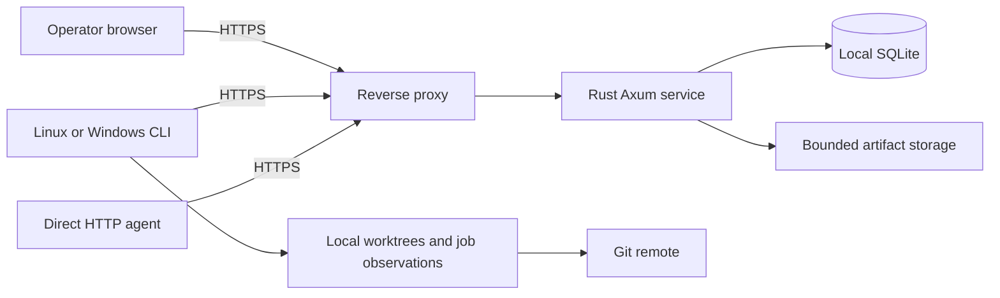

# Implementation structure and release acceptance

Status: implementation specification. Product choices remain authoritative in
[PLAN.md](../PLAN.md). No runtime implementation or tests exist yet.

The accepted target is 20 projects, 50 simultaneous agent sessions, and 100,000
historical tasks. The production host is undecided; use Ubuntu 24.04 LTS on
x86_64 with 2 CPU cores and 4 GB RAM as the engineering test baseline. Ubuntu
lists standard security maintenance for 24.04 LTS through May 2029 in its
[release lifecycle](https://ubuntu.com/about/release-cycle).

## Service boundaries

Use one Rust workspace with a domain/types library, server, reusable HTTP client,
and CLI/local-reporter executable. Keep ownership and workflow validation in
shared server-side application functions called by every HTTP surface. The CLI
does not have authority to bypass those functions. Serve embedded vanilla JS/CSS
assets from Axum; no Node process is needed on the installed server.

Proposed implementation libraries are Tokio/Axum, SQLx with SQLite migrations,
Serde, a Rust TLS HTTP client, Clap, tracing, Argon2id, and operating-system
cryptographic randomness. Verify supported versions and advisories when coding,
commit Cargo.lock, and keep dependency choices within these responsibilities.
No agent SDK, model API, vector database, queue service, or Git-hosting SDK is
required. Git operations occur on workstations under existing Git credentials.

## Relational model and invariants

Use ordinary relational records and append-only audit events, not a requirement
to rebuild the whole service through event replay. Store timestamps as UTC epoch
milliseconds internally; present RFC 3339 dates through the API. Use JSON only
for bounded structured content, not for identities or relationships requiring
foreign-key/uniqueness guarantees.

| Table group | Required fields and constraints |
| --- | --- |
| `projects`, `repositories`, `project_repositories` | Stable IDs; display names distinct from identity; explicit canonical repository and target binding; aliases resolved without guessing |
| `principals`, `credentials`, `browser_sessions` | Principal type/role, credential verifier, revocation/expiry, session verifier, audit identity retained after deactivation |
| `workstations`, `agent_sessions`, `reporters` | Issuing principal/credential, session proof verifier, instance identity, capabilities, bounded reporter scope/deadline, restore authority epoch |
| `project_permissions`, `policy_revisions` | Protected delegation/integration mode separate from editable binding-rule text; immutable policy revision and current pointer |
| `tasks`, `task_revisions` | Project/kind/lifecycle/priority, immutable criteria revision, current attempt and submission pointers, monotonically increasing ownership generation |
| `task_dependencies`, `task_children` | Unique edges, non-self references, project-consistent ownership, transactionally checked cycles and required-child meaning |
| `attempts`, `checkpoints` | Task/session/workstation, generation, state, lease deadline, mode, outcome and progress; unique task/generation; at most one structurally active attempt per task |
| `checkouts` | Workstation plus canonical resolved checkout identity; branch/base/path; no simultaneous editable use by different implementation attempts |
| `submissions`, `workflow_activities` | Immutable candidate and task/policy revisions; unique submission/activity-kind/slot; explicit subject task and linked review/integration task |
| `reviews`, `findings`, `integrations` | Candidate binding, actor/contributor attribution, decisions, stable finding IDs, target before/after and outcome certainty |
| `resources`, `reservations`, `reservation_items` | Canonical resource identity and scope, capacity, holder and units, active/recovery/released disposition; atomic set admission |
| `jobs`, `job_observations`, `check_evidence` | Producer instance, reporter, unique job/sequence, snapshot and check roster, terminal result/amendments, observation freshness separate from process state |
| `artifacts` | Generated storage key, digest/bytes/media type, project/source associations, finalized/expired/deleted state and retention |
| `knowledge`, `knowledge_revisions`, `knowledge_links` | Kind, project or common collection, source links, applicability, text, correction/supersession, usefulness feedback attribution |
| `decisions`, `authorizations`, `blockers` | Required actor type, concrete scope/revision/environment, rationale, answer, expiry/reopening condition, affected tasks |
| `imports`, `import_mappings` | Source identity/revision/digest, stable mappings, preview revision, applied outcome, unresolved links/conflicts |
| `events`, `mutation_receipts` | Monotonic event sequence, principal/session/operation/record attribution, mutation key/fingerprint/result or expiry tombstone |

Enable foreign-key enforcement on every connection. Project-owned records use
composite `(project_id, id)` references where needed to prevent attaching an
attempt or evidence to another project's task accidentally. Explicit common
knowledge references and canonical shared resources retain their own provenance.
All authenticated callers can still deliberately access every project. See
[SQLite foreign-key documentation](https://sqlite.org/foreignkeys.html).

Use a partial unique index for one attempt in stored `active` state per task.
Time is not part of that index predicate. An expired attempt is retired before
the recovery attempt is inserted, in the same transaction; every authoritative
operation separately checks its deadline. Keep the task pointer and generation
consistent in that transaction. See
[SQLite partial indexes](https://sqlite.org/partialindex.html).

Index the project/eligibility/priority/ready-time task queue, dependencies by
both endpoints, attempts by task and expiry, events by project/sequence, and
jobs by workstation/state. Use SQLite FTS5 for current searchable task/knowledge
text, updated transactionally alongside its source record. Treat index rebuild
as maintenance, without losing provenance or becoming a second authoritative
store. See [SQLite FTS5](https://sqlite.org/fts5.html).

## Transaction boundaries

Use WAL on local storage, bounded connection pools, bounded write-lock waits,
and short explicit write transactions. Coordination mutations begin with
`BEGIN IMMEDIATE`; check ownership time after obtaining the writer lock. On
an error, roll back the whole application transaction. A failed operation must
not accidentally commit earlier statements. Never hold a transaction while
uploading bytes, running Git/tests, waiting for humans, or making HTTP requests.
These choices follow [SQLite transaction behavior](https://sqlite.org/lang_transaction.html).

| Mutation | Must commit together |
| --- | --- |
| Claim/recovery claim | Authentication/permission and eligibility recheck; retire expired attempt when permitted; new attempt/generation/lease; task pointer; event and receipt |
| Renewal | Current session/attempt/generation/epoch/deadline and reporter-window checks; new capped deadline; receipt and compact audit data |
| Admission/dependency edit | Expected task revisions; complete graph check; updated edges/criteria/readiness; audit and receipt |
| Submit code/general work | Current authority and revisions; immutable outcome/evidence/handoff/new lessons; old attempt terminal; required activities created once; task pointers; event and receipt |
| Submit review | Current review authority and candidate; independence and actor-type checks; findings/decision; activity outcome; next workflow eligibility; event and receipt |
| Submit integration | Current candidate/policy/approvals/authorization/reservation; publication/result evidence and required checks; integration task and subject code task completion; event and receipt |
| Reserve a resource set | Every canonical capacity check including uncertain holders; all reservation items, or none; event and receipt |
| Revoke authority | Credential/session/reporter invalidation; affected attempt authority removed; uncertain resources preserved; audit and receipt |
| Policy update | Existing delegation check; expected revision; new immutable policy/current pointer; affected work marked for reconciliation; audit and receipt |
| Import apply | Preview identity and current service revision checks; mappings and nonconflicting adopted records; event and receipt; bounded batch size |

For imports too large for one short transaction, apply explicitly identified
chunks. A preview lists chunk boundaries, each committed chunk is resumable,
and the result reports partial completion honestly. Do not advertise all-or-none
atomicity for an arbitrarily large import.

Handle capacity limits using the writer transaction, not a preflight-only count.
Use an injectable service clock for expiry tests and monitor backward time jumps.
After a detected material clock anomaly, pause new authority and reconcile live
deadlines rather than extending leases implicitly. Restarts use persisted server
deadlines; restore uses a new authority epoch.

## Operation permissions

These are engineering defaults implementing all-project access and configurable
autonomy. They do not introduce project visibility grants.

| Operation | Human administrator | Human operator | Agent |
| --- | --- | --- | --- |
| Read every project's tasks/context/artifacts | Yes | Yes | Yes |
| Create/admit tasks; edit unowned open work with revision checks | Yes | Yes | Yes |
| Mutate an active attempt | Explicit override with reason | Explicit override with reason | Current owning session only |
| Publish/correct lessons | Yes | Yes | Yes |
| Change binding project rules | Yes | Yes | When delegated by that project |
| Grant/revoke rule-editing or integration delegation | Yes | Yes | No self-grant through rule text |
| Approve a human-required decision/review | Yes | Yes | No |
| Review as an independent agent | Not by representing a human as an agent | Not by representing a human as an agent | Separate eligible review session/attempt |
| Integrate code | Subject to workflow guards | Subject to workflow guards | Under project's automatic mode or applicable human authorization |
| Clear an uncertain resource | Explicit resolution with evidence/reason | Explicit resolution with evidence/reason | Only verified recovery evidence permitted by resource policy |
| Administer accounts/full agent tokens/server settings | Yes | No | No |

Agent task edits cannot seize another attempt. Closing or superseding unowned
work requires revision checks, rationale, and evidence where relevant; active
work or uncertain side effects require recovery or an explicit human override.
Keep human override distinct from evidence-based completion: it may cancel or
resolve authority, but cannot manufacture a test pass or a review record.

Human review uses the same candidate/check/revision guards without requiring the
person to impersonate an agent session. Browser authentication plus CSRF protects
its claim/decision operation. Do not leave browser review unusable by requiring
agent-only authentication headers on every mutation.

## Packaging and bounded operation

Produce native x86_64 Linux server/CLI releases and a native x86_64 Windows
CLI/reporter release as the initial engineering baseline; document source builds
for others until tested release targets are added. The installation includes a
systemd unit, configuration examples, proxy example, backup timer, migrations,
and an operator recovery guide. It must not change existing project hooks.

Engineering starting limits: 1 MiB JSON requests, 16 MiB per uploaded artifact,
10 GiB aggregate live artifact quota, and 50/200 default/max page size. Make
storage/request limits explicit configuration; reject excess before exhausting
memory/disk. Stream artifact bytes. Keep a disk-free reserve and give actionable
storage errors. Deployment disk sizing must include retained backups separately
from the live artifact quota.

Retain task/handoff/lesson history by default; archive it for normal browsing
without erasing closure/import identities. Propose a 90-day artifact retention
default, with explicit pinning for selected evidence and quota accounting. Keep
per-job/per-attempt first/last observation and progress; avoid an ever-growing
full JSON event for every unchanged one-minute heartbeat. Periodic health rollups
and terminal/checkpoint events preserve useful history. Semantic state changes
retain their audit records and provenance.

Expose minimal public liveness and authenticated diagnostics. Record request IDs,
operation latency, failed authentication totals, lock waits, lease/recovery state,
artifact usage, backup freshness, and disk capacity without credentials or raw
task prose in ordinary request logs. Use a five-second dashboard refresh default,
with visible freshness and an attention queue; realtime push is unnecessary for
first-release correctness.

## Acceptance gates

| Gate | Demonstration required before release |
| --- | --- |
| Ownership | Barrier-synchronized competing claims produce one owner; renewal/completion/recovery races and lock waits past expiry never produce two valid grants |
| Retries | Drop responses after commit; retry the same key; prove one task/attempt/submission and correct current-authority reporting |
| Workflows | Review starts from submission without circular waits; candidate edits invalidate applicability; integration/check failures keep dependents blocked |
| Multiple projects | Different projects claim concurrently; unrelated integration targets proceed concurrently; a deliberately shared target/resource serializes correctly |
| Auth and delegation | Public help exposes no project data; all authenticated callers see all projects; sessions isolate ownership; agent rule edits require delegation; agents cannot fabricate human review |
| Jobs and worktrees | Exercise Linux and native Windows checkouts with spaces, observer loss, PID reuse, a long job beyond the agent lease, and conflicting resource recovery |
| Context and migration | Re-import representative stale/closed/archive records without reopening work; retain broken-link warnings; retrieve corrected/common lessons with provenance |
| Artifacts | Enforce streaming quotas, authentication, safe downloads, partial-upload cleanup, missing/expired-link reporting, and database/file backup consistency |
| Operations | Fresh install, admin enrollment, rotation/revocation, upgrade, restart, disk pressure, and restore with old credentials/leases rejected |
| Usability | Complete a workflow from only the repository snippet and service help, both by CLI and direct HTTP; verify human review and decisions in the browser |

Use deterministic clocks and synchronized real SQLite transactions for protocol
tests. Add process-level integration tests where shutdowns, local producer state,
or persistence matter. Test native Windows behavior on Windows, not merely with
Windows-looking strings on Linux. Sanitize reference-project fixtures; do not
upload production histories, run project hooks, or touch live Git/SQL targets as
part of automated tests.

Benchmark on the baseline with 20 projects, 100,000 historical tasks, and 50
simultaneous agent sessions. Engineering workload target: 50 API requests/second, 40
reads and 10 writes, for 30 minutes; burst 100 simultaneous claims; include a
concurrent artifact upload and backup. Target p95 under 500 ms for ordinary
metadata operations, no unexpected server errors or incorrect ownership, and
bounded memory under the machine's capacity. These are acceptance targets, not
claims of measured performance. Report latency and resource measurements.

The final two-workstation exercise uses isolated sample repositories: create two
projects; race claims; publish and recover checkpoints; keep an observed long
job alive across session loss; review an exact candidate; serialize integration;
verify downstream readiness and shared lessons; restore a backup and reconcile
authority. No customer repository is needed to prove the protocol.
